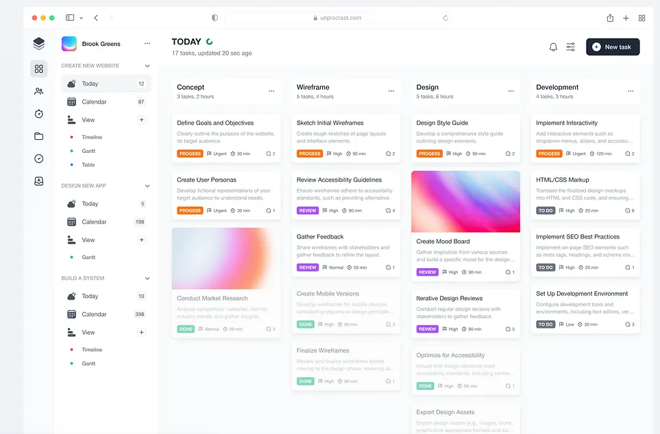

# Vector

Spec-driven project management for developers who work with Claude Code.

## What is Vector

Vector keeps the specs you build with Claude Code on a kanban board. Each idea becomes a spec
card, and the card moves through states (open, in-progress, review, closed) as the work
progresses. The board is a projection of a JSON record that the CLI owns, so what you see always
matches what is on disk.

It is built for senior developers, not for project managers. The board helps you track specs and
the tokens they cost, not to produce status reports for someone else. Vector stays agnostic to
your code: it adds structure around how you drive agents without imposing a framework or a folder
layout on the repo you point it at.

Two ideas sit at the center. The first is token efficiency, which Vector treats as a feature
rather than a cleanup task for later: trivial work like lookups and summaries routes to cheaper
agents, and the expensive models handle design and implementation. The second is a single source
of truth. The JSON state drives the board, the standup digest, and the activity trace, so nothing
drifts out of sync.



## Why Vector

- **Token routing.** Every command picks the cheapest agent that can do the job. A Haiku agent
  writes a standup digest; an Opus agent implements a change. You pay for capability where it
  earns its cost.
- **A board you can trust.** The kanban view is rendered from the JSON state, updated live over
  SSE. There is no second copy of the truth in the frontend or in a database.
- **Native to Claude Code.** The `/vector:*` commands run inside Claude Code as project commands.
  They are markdown files seeded into your repo, so the workflow lives next to your code.
- **Agnostic to your stack.** Vector detects your build, test, and lint commands during
  `vector init` and records them. It does not assume Go, Node, or anything else about your repo.

## Installation

**Prerequisite: Go 1.26+** (the version declared in `cli/go.mod`). Check your version with
`go version` before building, or the build will fail without an obvious reason.

The single supported path today is to clone the repo and build the binary locally:

```bash
git clone https://github.com/mcampbellr/vector.git
cd vector/cli
go build -o ~/.local/bin/vector ./cmd/vector
```

Make sure `~/.local/bin` is on your `PATH`. Then, inside each repo you want to manage:

```bash
cd <your-project>
vector init
```

`vector init` seeds the `/vector:*` commands into `.claude/commands/vector/`, detects your stack,
and creates the `.vector/` state directory.

> A one-line installer (`curl … | install.sh`) is planned but not available yet. Use the
> clone-and-build steps above until it ships.

## Quickstart

From an existing repo, four steps take you from nothing to a card on the board:

```bash
vector init                      # seed the commands and detect your stack
```

```text
/vector:raw "add user authentication"   # in Claude Code: create a spec
```

```bash
vector serve                     # open the local board
```

The spec you created with `/vector:raw` shows up in the `open` column. Open the board in your
browser to watch it move as you propose and apply the change.

## Key Concepts

| Concept | What it means |
|---|---|
| **spec** | The unit of work, equivalent to a card on the board. You create one with `/vector:raw`. It carries a status, a priority, and an optional ticket link. |
| **OpenSpec** | The change model Vector builds on (proposal / design / tasks). A spec becomes an OpenSpec change when you formalize it with `/vector:propose`. |
| **board** | The kanban view. Columns are spec *states* (open, in-progress, needs-attention, review, closed, archived). See [`docs/domain-contract.md`](docs/domain-contract.md). |
| **token routing** | Each command sends a task to the cheapest capable agent. Trivial work goes to Haiku or Sonnet; implementation goes to Opus. |
| **`/vector:*` commands** | Project commands that run inside Claude Code, seeded into `.claude/commands/vector/`. See [`docs/plugin-and-commands.md`](docs/plugin-and-commands.md). |
| **`vector init`** | The terminal subcommand that bootstraps a repo: it seeds the commands, detects your stack, and asks for consent before touching anything. |

## Commands Reference

The `/vector:*` commands run inside Claude Code. The binary owns every write to the board state;
the commands call it rather than editing `.vector/` by hand.

| Command | What it does |
|---|---|
| `/vector:raw` | Turn a raw idea into a complete, validated 20-section spec and register it on the board as a draft. |
| `/vector:research` | Investigate whether an idea is worth building first: run feasibility lenses, gate a go/no-go verdict, then author the spec with the report embedded. |
| `/vector:bug` | Turn a bug report into a validated spec, deducing the root cause from git history and recording it as a queryable relation. |
| `/vector:propose` | Formalize a draft spec into an OpenSpec change (proposal, design, tasks) and move the card from draft to open. |
| `/vector:apply` | Pick the next work-item by status and priority, start it, and implement the change. Autonomy is configurable. |
| `/vector:fix` | Correct work already specified on the board (a missed detail, a UAT finding, a small course-correction) through the refiner and clarity gate. |
| `/vector:quick` | Apply a small, low-risk change in a single run: register a quick-win card, implement it, run the gate, and land it in review. |
| `/vector:comment` | Evaluate a review or ticket comment against the real diff with a skeptical agent, and implement only when the comment is valid and low-risk. |
| `/vector:link` | Link a spec card to its external ticket (Jira, Linear, GitHub), inferring the provider from the reference. |
| `/vector:status` | Move a spec to a target status when the transition is legal. Use it to flag or clear needs-attention. |
| `/vector:close` | Close a finished spec, flipping its card to closed after review. |
| `/vector:archive` | Archive a closed spec, moving its card out of the active board into the archived view. |
| `/vector:standup` | Project the activity since your last standup and generate a scrum digest with a cheap agent. |
| `/vector:sync` | Import a repo's existing OpenSpec changes onto the board, idempotently. |

## Walkthrough — End-to-End Flow

Here is the life of a single spec, start to finish.

You run `vector init` in your repo. Vector seeds the `/vector:*` commands into
`.claude/commands/vector/`, detects how you build and test, and writes the `.vector/` state
directory.

In Claude Code, you run `/vector:raw "add user authentication"`. Vector authors a full spec at
`.vector/specs/add-user-authentication/spec.md` and the card appears in the `open` column.

When you are ready to plan the change, you run `/vector:propose`. Claude drafts the OpenSpec
artifacts (proposal, design, tasks) and may ask a few clarifying questions before moving the card
from draft to open.

You run `/vector:apply`. Claude implements the spec, checking off the tasks as it goes. The card
moves to `in-progress` while the work happens, then to `review` once the build and tests pass.

Throughout, `vector serve` keeps a local board open in your browser. It reflects each transition
in real time over SSE, so you watch the card travel across the columns as the work lands.

## Contributing / License

Contributions are welcome. Open an issue to report a bug or propose a feature, and send a pull
request for changes. Keep commits and PR text in English, and run the build and tests before
opening a PR.

**License: TBD.** No license has been chosen for this project yet. Until one is added, treat the
code as all-rights-reserved and ask before reusing it.

## Further Reading

- [`docs/vision.md`](docs/vision.md) — the full vision and the design decisions behind it
- [`docs/domain-contract.md`](docs/domain-contract.md) — board states and the domain model
- [`docs/plugin-and-commands.md`](docs/plugin-and-commands.md) — the commands and plugin model
- [`docs/commercialization.md`](docs/commercialization.md) — distribution and packaging
